# Platform Engine - Complete Authentication & Development Stack

A comprehensive full-stack platform featuring automated Keycloak authentication, React frontend, Flask API, and PostgreSQL databases with intelligent service orchestration and optimized development workflow.

## 🏗️ Architecture

```mermaid
flowchart TB
    subgraph "🔐 Authentication Services"
        KC[Keycloak Server<br/>:8080]:::auth
        PG_AUTH[(PostgreSQL Auth<br/>:5432)]:::db
        SETUP[Keycloak Setup<br/>Service]:::setup
        KC --> PG_AUTH
        SETUP --> KC
    end

    subgraph "🚀 Application Services"
        WEB[React Web App<br/>:3000]:::web
        API[Flask API<br/>:4000]:::api
        PG_API[(PostgreSQL API<br/>:5433)]:::db
        API --> PG_API
    end

    subgraph "🔄 Service Dependencies"
        PG_AUTH -.->|health check| KC
        KC -.->|health check| SETUP
        SETUP -.->|configured| API
        SETUP -.->|configured| WEB
    end

    WEB -->|authenticate| KC
    WEB -->|API requests| API
    API -->|validate tokens| KC

    classDef auth fill:#e1f5fe,stroke:#01579b,stroke-width:2px,color:#01579b
    classDef web fill:#f3e5f5,stroke:#4a148c,stroke-width:2px,color:#4a148c
    classDef api fill:#e8f5e8,stroke:#1b5e20,stroke-width:2px,color:#1b5e20
    classDef db fill:#fff3e0,stroke:#e65100,stroke-width:2px,color:#e65100
    classDef setup fill:#fce4ec,stroke:#880e4f,stroke-width:2px,color:#880e4f
```



## 🚀 Quick Start

### Prerequisites
- Docker & Docker Compose
- Git

### One-Command Setup
```bash
# Clone and start everything (runs in background)
git clone <repository-url>
cd platform_engine
make quick-start
```

That's it! The system will automatically:
- ✅ Start all databases with health checks
- ✅ Launch Keycloak with proper configuration  
- ✅ Create realm and clients automatically
- ✅ Start API and Web services in background
- ✅ Handle service dependencies and startup order
- ✅ Return control to your terminal immediately

**After startup, the command will show you next steps:**
- Check status: `make check-status`
- Follow logs: `make follow-all-logs`
- Test endpoints: `make test-endpoints`

## 🎯 Services & Endpoints

| Service | URL | Credentials | Purpose |
|---------|-----|-------------|---------|
| **Web App** | http://localhost:3000 | - | React frontend with Keycloak auth |
| **API** | http://localhost:4000 | - | Flask backend with token validation |
| **Keycloak** | http://localhost:8080 | `platform_admin` / `platform_secure_password_2024` | Authentication server |
| **Auth DB** | localhost:5432 | `keycloak_user` / `keycloak_password` | Keycloak database |
| **API DB** | localhost:5433 | `api_user` / `api_password` | Application database |

## 📖 Common Development Scenarios

### 🆕 Starting Development for the First Time
```bash
# Complete platform setup (runs in background)
make quick-start

# Or just web development (runs in background)
make web-only

# Want to see logs? Use foreground versions:
make quick-start-foreground
make web-foreground
```

### 💻 Daily Web Development (Recommended)
```bash
# Navigate to web directory
cd platform-engine-web

# Start development in background with live reload
make dev-start

# Your code changes will appear automatically!
# Access: http://localhost:3000

# To see logs in real-time:
make dev-logs-live
```

### 🔍 Checking What's Running
```bash
# Check all services status
make check-status

# Follow all logs in real-time
make follow-all-logs

# Test if endpoints are responding
make test-endpoints
```

### 🔄 When Things Go Wrong
```bash
# Something not working? Fresh start:
make fresh-start

# Web container issues? Clean restart:
make web-clean

# Or from web directory:
cd platform-engine-web
make dev-clean
```

### 📦 Package Changes (package.json)
```bash
# From root directory:
make web-rebuild

# Or from web directory:
cd platform-engine-web
make dev-rebuild
```

### 🛑 Stopping Development
```bash
# Stop everything
make stop-all

# Stop just web development
cd platform-engine-web
make dev-stop
```

## 🛠️ All Available Commands

### 🚀 QUICK START (Background by default)
- `make quick-start` - Start complete platform in background
- `make quick-start-foreground` - Start complete platform with logs visible
- `make fresh-start` - Clean everything and start fresh in background
- `make fresh-start-foreground` - Clean everything and start fresh with logs

### 🎯 INDIVIDUAL SERVICES (Background by default)
- `make web-only` - Start web development in background
- `make web-foreground` - Start web development with logs visible  
- `make api-only` - Start API development in background
- `make api-foreground` - Start API development with logs visible
- `make auth-only` - Start Keycloak authentication

### 📊 MONITORING
- `make show-all-logs` - Show all service logs
- `make follow-all-logs` - Follow all logs in real-time
- `make web-logs` - Show web service logs
- `make api-logs` - Show API service logs
- `make auth-logs` - Show Keycloak logs

### 📈 STATUS & HEALTH
- `make check-status` - Check all services status
- `make check-health` - Check service health
- `make test-endpoints` - Test all service endpoints

### 🔄 RESTART & MANAGEMENT
- `make restart-all` - Restart all services
- `make restart-web` - Restart web service
- `make restart-api` - Restart API service
- `make restart-auth` - Restart authentication service
- `make web-rebuild` - Rebuild web (for package changes)
- `make web-clean` - Clean restart web service

### ⚙️ SETUP & CONFIGURATION
- `make setup-auth-only` - Setup only Keycloak authentication
- `make reconfigure-auth` - Reconfigure Keycloak

### 🛑 STOP & CLEANUP
- `make stop-all` - Stop all services
- `make clean-containers` - Clean containers and networks
- `make clean-everything` - Deep clean including data
- `make complete-reset` - Complete reset and restart

### 💾 DATABASE
- `make db-logs` - Show database logs
- `make backup-databases` - Backup all databases

## 🚀 Web Development with Live Reload

The web application supports efficient development with volume mounting and live reloading. No more full Docker rebuilds for code changes!

### 📁 Volume Mounting Configuration

The `platform-engine-web/docker-compose.yaml` is configured with:
```yaml
volumes:
  - .:/app                    # Mount source code for live changes
  - /app/node_modules         # Preserve container node_modules
```

### 🔧 Web Development Commands

#### From Web Directory (`cd platform-engine-web`)

**🚀 QUICK START:**
- `make dev-start` - Start development in background (live reload)
- `make dev-foreground` - Start development with logs visible
- `make local-start` - Start locally without Docker

**📦 SETUP:**
- `make install-deps` - Install project dependencies
- `make setup-project` - Complete project setup

**🔍 CODE QUALITY:**
- `make check-code` - Run linting checks
- `make format-code` - Format all code
- `make build-app` - Build for production

**🔧 DEVELOPMENT TOOLS:**
- `make dev-logs` - Show container logs
- `make dev-logs-live` - Follow logs in real-time
- `make dev-status` - Check container status
- `make dev-shell` - Open shell in container

**🔄 RESTART & RELOAD:**
- `make dev-restart` - Restart container
- `make dev-rebuild` - Rebuild container (for package changes)
- `make dev-stop` - Stop development

**🧹 CLEANUP:**
- `make dev-clean` - Clean restart
- `make dev-reset` - Complete reset

### 🔄 Live Development Workflow

1. **Start Development Environment:**
   ```bash
   cd platform-engine-web
   make dev-start
   ```

2. **Make Code Changes:**
   - Edit any file in `src/` directory
   - Changes automatically detected by Vite
   - Browser refreshes automatically

3. **Monitor Changes:**
   ```bash
   make dev-logs-live
   ```

4. **When Needed:**
   - `make dev-restart` - if container issues
   - `make dev-rebuild` - if package.json changes
   - `make dev-clean` - for complete reset

## 🎯 Command Quick Reference

| What you want to do | Command |
|-------------------|---------|
| **Start developing** | `make quick-start` |
| **Web development only** | `make web-only` |
| **Check what's running** | `make check-status` |
| **Something broken** | `make fresh-start` |
| **Package changes** | `make web-rebuild` |
| **Stop everything** | `make stop-all` |
| **See logs** | `make follow-all-logs` |

## 🔧 Smart Features

### 🧠 Intelligent Admin Management
- **Smart Admin Selection**: Automatically uses available admin (platform_admin or temp admin)
- **Safe Admin Lifecycle**: Creates permanent admin before deleting temporary one
- **Fallback Logic**: Gracefully handles admin user transitions

### 🔄 Service Orchestration
- **Health Check Dependencies**: Services wait for dependencies to be healthy
- **Startup Sequencing**: Databases → Keycloak → Setup → Applications
- **Automatic Configuration**: Realm and clients created automatically
- **Retry Logic**: Built-in retries for service startup
- **Background Execution**: All commands run in background by default

### 📊 Development Workflow Optimization
- **Volume Mounting**: Live code changes without rebuilds
- **Live Reloading**: Instant code changes with Vite
- **Layer Caching**: Faster builds when dependencies don't change
- **Background Services**: Terminal stays free for other commands
- **Next-Step Guidance**: Commands show what to do next

### 📊 Monitoring & Debugging
- **Detached Mode**: Run services in background while monitoring logs
- **Service-Specific Logs**: Monitor individual service logs
- **Health Checks**: Real-time service health monitoring
- **Status Dashboard**: Quick overview of all services

## 🏗️ Technical Stack

### Frontend (React + TypeScript)
- **Framework**: React 18 with TypeScript
- **Build Tool**: Vite for fast development with hot reloading
- **Authentication**: Keycloak-js integration
- **Styling**: TailwindCSS with modern responsive design
- **Routing**: React Router with protected routes
- **Components**: Modern UI components with proper authentication flows

### Backend (Flask + Python)
- **Framework**: Flask with Poetry dependency management
- **Authentication**: Authlib OAuth2 integration
- **Database**: PostgreSQL with SQLAlchemy
- **API**: RESTful endpoints with token validation

### Authentication (Keycloak)
- **Version**: Keycloak 20.0
- **Database**: PostgreSQL 15
- **Configuration**: Automated realm and client setup
- **Security**: Enhanced security settings and HTTPS support

### Infrastructure (Docker)
- **Multi-service**: Docker Compose orchestration
- **Health Checks**: Container health monitoring
- **Volume Mounting**: Live development workflow
- **Network Isolation**: Secure inter-service communication
- **Background Execution**: Non-blocking development workflow

## 💡 Pro Tips

1. **All main commands run in background by default** - your terminal stays free!
2. **For daily web development:** Use `cd platform-engine-web && make dev-start`
3. **Live reload is automatic** - just save your files!
4. **Want to see logs?** Use `make follow-all-logs` or `*-foreground` commands
5. **Use `make help`** for complete command list
6. **Use `make web-help`** for web-specific commands
7. **Check status first** with `make check-status` when something's wrong

## ⚡ Background vs Foreground

**Background (default):** Commands return immediately, services run in background
- `make quick-start` - starts and returns to prompt
- `make web-only` - starts web dev and returns to prompt

**Foreground:** Commands show logs and block terminal until stopped
- `make quick-start-foreground` - shows logs, blocks terminal
- `make web-foreground` - shows logs, blocks terminal

## 🆘 Troubleshooting

| Problem | Solution |
|---------|----------|
| **Not sure what's running** | `make check-status` |
| **Want to see logs** | `make follow-all-logs` |
| **Web not loading** | `make web-clean` |
| **Everything broken** | `make fresh-start` |
| **Package changes** | `make web-rebuild` |
| **Port already in use** | `make stop-all` then restart |

## 📚 Help Commands

```bash
# Main help (from root directory)
make help

# Web-specific help (from platform-engine-web directory)  
make web-help
```

## ✅ Benefits

- **⚡ Live Reload**: Instant code changes without rebuilds
- **🔄 Volume Mounting**: Source code synchronized with container
- **📦 Layer Caching**: Faster builds when dependencies don't change
- **🎯 Background Execution**: Terminal stays free for other commands
- **🔍 Easy Monitoring**: Dedicated logging and status commands
- **📖 Next-Step Guidance**: Commands show what to do next
- **🎯 Scenario-Based**: Commands match what you want to do

## 🚦 Quick Start Summary

```bash
# Navigate to platform directory
cd platform_engine

# Start development environment (background)
make quick-start

# Check that everything is running
make check-status

# For web development, open another terminal:
cd platform-engine-web
make dev-start

# Open browser to http://localhost:3000
# Make code changes - they'll appear instantly!

# Monitor logs if needed
make dev-logs-live
```

This workflow eliminates the need for full Docker rebuilds during development while maintaining containerized consistency and keeping your terminal free for other commands.
git clone <repository-url>
cd platform_engine
make start
```

That's it! The system will automatically:
- ✅ Start all databases with health checks
- ✅ Launch Keycloak with proper configuration
- ✅ Create realm and clients automatically
- ✅ Start API and Web services
- ✅ Handle service dependencies and startup order

## 🎯 Services & Endpoints

| Service | URL | Credentials | Purpose |
|---------|-----|-------------|---------|
| **Web App** | http://localhost:3000 | - | React frontend with Keycloak auth |
| **API** | http://localhost:4000 | - | Flask backend with token validation |
| **Keycloak** | http://localhost:8080 | `platform_admin` / `platform_secure_password_2024` | Authentication server |
| **Auth DB** | localhost:5432 | `keycloak_user` / `keycloak_password` | Keycloak database |
| **API DB** | localhost:5433 | `api_user` / `api_password` | Application database |

## 🛠️ Development Commands

### Essential Commands
```bash
# Start development environment
make dev                    # Foreground with logs
make dev-detached          # Background mode

# Monitor services
make logs                  # Show all logs
make logs-follow          # Follow logs (Ctrl+C to stop)
make logs-api             # Follow API logs only
make status               # Check service status

# Service management
make restart              # Restart all services
make restart-api          # Restart API only
make stop                 # Stop all services
```

### Advanced Commands
```bash
# Testing
make test-services        # Test all endpoints
make health              # Check service health

# Fresh setup
make start-fresh         # Clean start with fresh containers
make reset              # Complete reset and restart

# Cleanup
make clean              # Remove containers/networks
make clean-all          # Deep clean everything

# Help
make help               # Show all available commands
```

## 🔧 Smart Features

### 🧠 Intelligent Admin Management
- **Smart Admin Selection**: Automatically uses available admin (platform_admin or temp admin)
- **Safe Admin Lifecycle**: Creates permanent admin before deleting temporary one
- **Fallback Logic**: Gracefully handles admin user transitions

### 🔄 Service Orchestration
- **Health Check Dependencies**: Services wait for dependencies to be healthy
- **Startup Sequencing**: Databases → Keycloak → Setup → Applications
- **Automatic Configuration**: Realm and clients created automatically
- **Retry Logic**: Built-in retries for service startup

### 📊 Monitoring & Debugging
- **Detached Mode**: Run services in background while monitoring logs
- **Service-Specific Logs**: Monitor individual service logs
- **Health Checks**: Real-time service health monitoring
- **Status Dashboard**: Quick overview of all services

## 🏗️ Technical Stack

### Frontend (React + TypeScript)
- **Framework**: React 18 with TypeScript
- **Build Tool**: Vite for fast development
- **Authentication**: Keycloak-js integration
- **Styling**: Modern CSS with responsive design

### Backend (Flask + Python)
- **Framework**: Flask with Poetry dependency management
- **Authentication**: Authlib OAuth2 integration
- **Database**: PostgreSQL with SQLAlchemy
- **API**: RESTful endpoints with token validation

### Authentication (Keycloak)
- **Version**: Keycloak 20.0
- **Database**: PostgreSQL 15
- **Configuration**: Automated realm and client setup
- **Security**: Enhanced security settings and HTTPS support

### Infrastructure (Docker)
- **Orchestration**: Docker Compose with health checks
- **Dependencies**: Service dependency management
- **Volumes**: Persistent data storage
- **Networks**: Isolated container networking

## 📁 Project Structure

```
platform_engine/
├── docker-compose.yaml          # Main orchestration file
├── Makefile                     # Development commands
├── README.md                    # This file
├── 
├── keycloak-auth/               # Keycloak setup and configuration
│   ├── scripts/
│   │   ├── keycloak_config.py   # Smart admin management
│   │   ├── keycloak_clients_config.py  # Client setup
│   │   ├── entrypoint.py        # Main setup orchestrator
│   │   └── simple_test_keycloak.py     # API-based testing
│   └── docker-compose.yaml     # Keycloak standalone setup
│
├── platform-engine-api/        # Flask API service
│   ├── api/
│   │   ├── app.py              # Main Flask application
│   │   ├── auth.py             # Authentication middleware
│   │   └── models.py           # Database models
│   ├── Dockerfile              # API container definition
│   └── pyproject.toml          # Python dependencies
│
└── platform-engine-web/        # React frontend
    ├── src/
    │   ├── components/         # React components
    │   ├── context/           # Keycloak context
    │   ├── hooks/             # Custom hooks
    │   └── pages/             # Application pages
    ├── Dockerfile             # Web container definition
    └── package.json           # Node.js dependencies
```

## 🔐 Authentication Flow

1. **User Access**: User visits web application
2. **Login Redirect**: App redirects to Keycloak login
3. **Authentication**: User logs in via Keycloak
4. **Token Return**: Keycloak returns JWT token
5. **API Requests**: Web app includes token in API calls
6. **Token Validation**: API validates token with Keycloak
7. **Response**: API returns data if token is valid

## 🧪 Testing

### Automated Testing
```bash
# Test all service endpoints
make test-services

# Check service health
make health

# View setup logs
make logs-setup
```

### Manual Testing
1. **Web App**: Visit http://localhost:3000
2. **API**: Test endpoints at http://localhost:4000
3. **Keycloak**: Admin console at http://localhost:8080

## 🚨 Troubleshooting

### Common Issues

**Services not starting:**
```bash
make logs-follow              # Check startup logs
make health                   # Check service health
make clean && make start      # Clean restart
```

**Authentication issues:**
```bash
make logs-keycloak           # Check Keycloak logs
make logs-setup              # Check setup logs
make reconfigure             # Re-run setup
```

**Database connectivity:**
```bash
make db-logs                 # Check database logs
make restart                 # Restart all services
```

### Debug Mode
```bash
# Start with full logging
make dev

# Monitor specific service
make logs-api     # or logs-web, logs-keycloak
```

## 🔄 Development Workflow

1. **Start Development**:
   ```bash
   make dev-detached
   ```

2. **Monitor Logs**:
   ```bash
   make logs-follow
   ```

3. **Make Changes**: Edit code files

4. **Restart Services**:
   ```bash
   make restart-api    # For API changes
   make restart-web    # For frontend changes
   ```

5. **Test Changes**:
   ```bash
   make test-services
   ```

## 🎉 What's New

### Latest Features
- ✅ **Smart Admin Management**: Intelligent admin user lifecycle
- ✅ **Health Check Dependencies**: Proper service startup order
- ✅ **Automated Configuration**: Zero-manual-setup realm/client creation
- ✅ **Enhanced Makefile**: Comprehensive development commands
- ✅ **Detached Mode Support**: Background services with log monitoring
- ✅ **Service Orchestration**: Dependencies and startup sequencing
- ✅ **Comprehensive Testing**: Automated endpoint validation

### Technical Improvements
- ✅ **PostgreSQL Health Checks**: Proper database connection validation
- ✅ **Keycloak Health Checks**: Service availability monitoring
- ✅ **Container Dependencies**: Service dependency management
- ✅ **Network Isolation**: Secure container networking
- ✅ **Volume Persistence**: Data persistence across restarts

## 📞 Support

For issues, questions, or contributions:
1. Check the troubleshooting section above
2. Review service logs: `make logs-follow`
3. Create an issue with relevant logs and steps to reproduce

---

**Happy coding! 🚀**

---

**Happy coding! 🚀**
